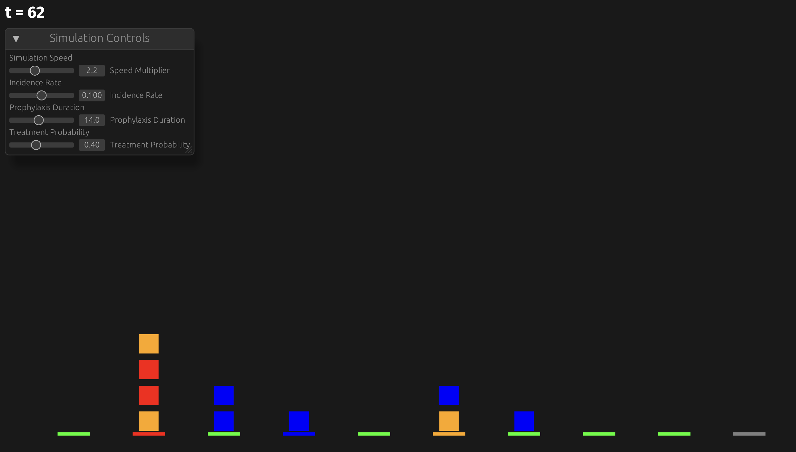

A demonstration project to see how well I can use fine-tuned ChatGPTs (like [this one](https://chatgpt.com/g/g-adLNAVhO9-bevy) tuned on Bevy) or VSCode [agent mode](https://github.blog/news-insights/product-news/github-copilot-agent-mode-activated/) to accelerate porting existing code logic from a [Python discrete-event simulation demo](https://github.com/InstituteforDiseaseModeling/sandbox-ewenger/tree/master/pySIMPLEGEN) into Bevy framework in Rust.

To launch the interactive demo yourself, run the following from the commandline:

> cargo run

You'll have to have `rustup` installed already.  Instructions [here](https://www.rust-lang.org/learn/get-started).



Move the sliders to change parameter values and visualization speed.  Lower bars represent `HostState` and squares stacked above them represent `InfectionState` of each `Inoculation` component.

Color codes are the following:

```
HostState::P => Color::GREEN, // Prophylaxis
HostState::A => Color::RED,   // Acute
HostState::C => Color::ORANGE, // Chronic
HostState::E => Color::BLUE,  // Exposed
HostState::S => Color::GRAY,  // Susceptible
```
